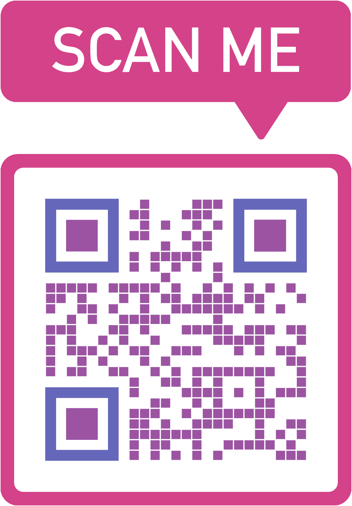

#  The Safe Store

### Customer Representative chatbot

Facebook Messenger Hackathon's entry

With so much focus on online shopping, we thought it would be great to find a way to support retail stores during the Covid-19 pandemic.

#### The challenge:

How to create comfortable interactions between a sales representative and a customer while maintaining safe distance.

#### Our solution:

A Facebook Messenger's chatbot that serves as a sales representative. You only need to scan a QR code, login to Facebook's Messenger, and answer a set of questions related to which product you're looking for. Once you answer the questions, you'll receive all the items that match your query, and you can choose which one you want.

#### How can I try it?

Unfortunately, you're unable to try it as the app needs to be verified by Facebook before it's enabled for all users. Due to the COVID-19 pandemic, only real businesses are being verified. **Only developers and people added as testers will get replies back from the chatbot.**

